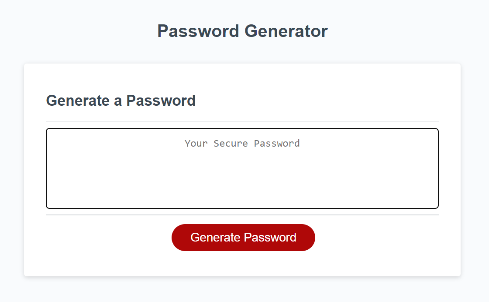
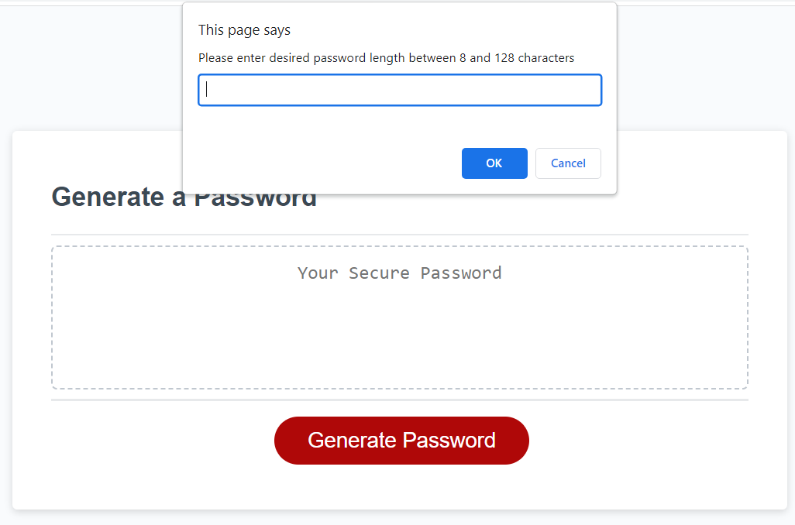
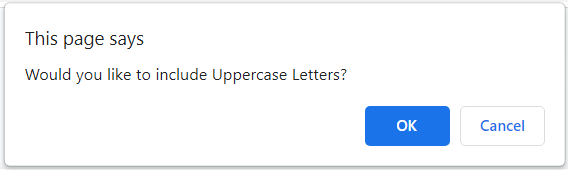
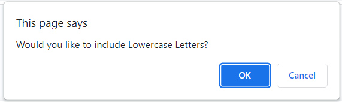
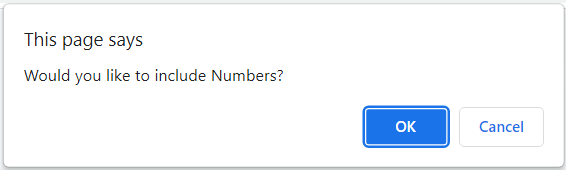
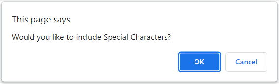

# Password Generator

## Description

This is a random password generator. The passwords are required to be at least 8 characters long and at most 128 characters long. The user will select the length of the password and what characters to include from Uppercase letters, Lowercase letters, Numbers, and Special characters. This is helpful to create a secure password that could be used permanently or temporarily if desired.

## Table of Contents

- [Project-Links](#Project-Links)
- [Usage](#Usage)
- [Screenshots](#Screenshots)
- [Credits](#Credits)
- [License](#License)
- [Tests](#Tests)

## Project-Links

 - [Password_Generator](https://hvansalisbury.github.io/Password-Generator/)
 - [Github-Repository](https://github.com/hvansalisbury/Password-Generator/)

## Usage

To use this random password generator, click on the button that says "Generate Password."

You will prompted to enter the desired length of your password between 8 and 128 characters long. It should not allow you to continue if the numbers fall outside of this range or if the value is not a number.

Afterwards, you will be asked if you would like to use Uppercase letters, Lowercase letters, Numbers, and Special characters. Click OK for YES, and cancel for NO.

You will then be reminded of your selections and the password will be generated afterwards.

## Screenshots

## Credits

 - [Github](https://github.com/hvansalisbury/Password-Generator)
 - [Stack Overflow](https://stackoverflow.com)
 - [W3 Schools](https://www.w3schools.com/)
 - [Mozilla Developer Network](https://developer.mozilla.org/en-US/)
 - [Geeks for Geeks](https://www.geeksforgeeks.org)

## License

 - [MIT License](https://choosealicense.com/licenses/mit/)

## Tests

In the length prompt try anything and everything to see if the generator works. Additionally, there are 16 combinations for the 4 categories of categories. This is the sum of all the combinations. 4C0 = 1, 4C1 = 4, 4C2 = 6, 4C3 = 4, 4C4 = 1. 1 + 4 + 6 + 4 + 1 = 16. Try out all the different combinations to make sure they all work properly. 